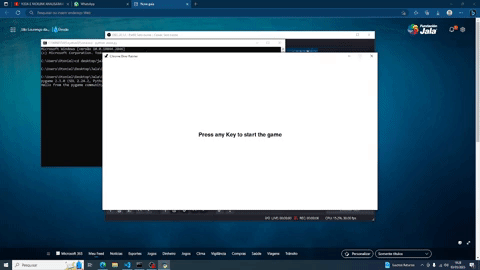

# Dino-Runner
Replica do jogo do dinossauro do google chrome, feito como projeto do curso de admissão da Jala University.

    

## Ferramentas
 - IDE: Vscode
 - Linguagem de Programção: Python 3
 - Biblioteca: Pygame